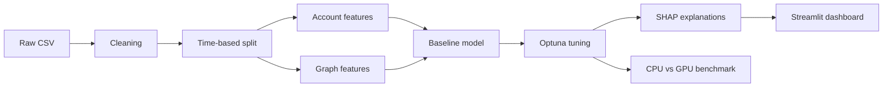
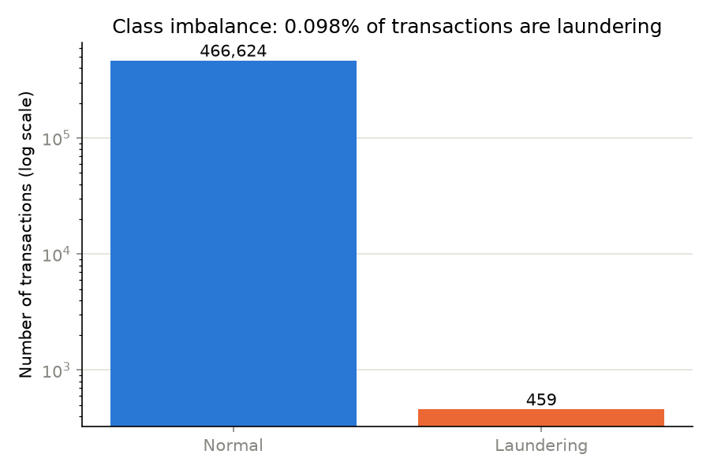
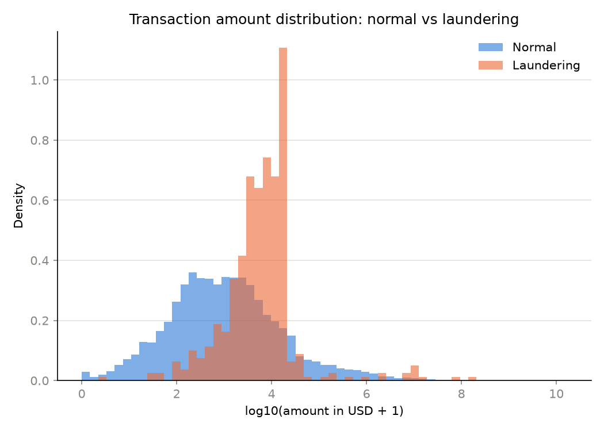
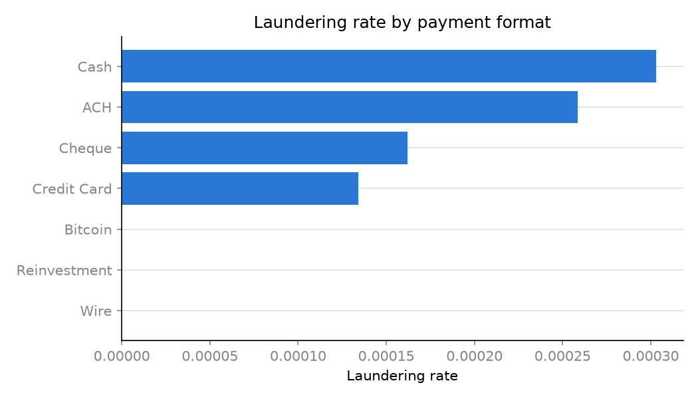

# AML Detection: Finding Money Laundering in Bank Transactions

End-to-end anti-money laundering detection on synthetic bank transactions: data cleaning, graph features, Optuna-tuned XGBoost, SHAP explanations, and CPU vs GPU benchmarks.

> Status: work in progress. Phases are being completed one at a time.

---

## The problem

Banks are legally required to monitor transactions for money laundering. Rule-based systems
catch some cases but produce a very high number of false alerts, and every alert costs an
analyst time to review. The goal here is to flag suspicious transactions more accurately,
explain why each one was flagged, and show how much faster the pipeline runs on a GPU.

## Dataset

- IBM Transactions for Anti Money Laundering (AML), from Kaggle
- File used: `HI-Small_Trans.csv` (~5 million transactions)
- The data is **synthetic**, generated by IBM. Results here should not be read as real-world
  performance, but the pipeline and methods are the same ones a real system would use.

## Pipeline



## Data cleaning

Full findings and every decision are in `results/metrics/cleaning_report.md` (regenerated each time
`python -m src.data_cleaning` runs). Summary, based on the 5% development sample
(`sample_frac` in `config.yaml`; results will change once the full dataset is used):

- Started from 253,917 sampled rows (5,078,345 in the full raw file), 0 exact duplicates and 0
  invalid (zero/negative) amounts in this sample, so no rows were dropped in this particular run.
- Account numbers turned out to be unique across banks in this sample (no from_bank/from_account
  collisions found), but `from_id`/`to_id` (bank + account) are kept anyway since the dataset docs
  say collisions are possible elsewhere in the full file.
- 72.9% of rows are self-transfers (same account on both sides). This looked alarming at first, so
  it was checked by payment format rather than accepted as-is: `Reinvestment` is 100.0%
  self-transfers and `Bitcoin` is 74.0%, while genuine transfers between different accounts
  (`Cash`, `Wire`, `Cheque`, `Credit Card`, `ACH`) are almost never self-transfers (0.2%-8.1%).
  So the high rate is explained by these two formats, not a data error. Self-transfers are kept
  (not dropped) and flagged with an `is_self_transfer` column.
- Currency conversion: exchange rates to USD are inferred from the data itself (see
  `src/data_cleaning.py: infer_exchange_rates`), since no fixed rate table is provided. Rates
  based on few supporting rows (e.g. Bitcoin: 19 rows, Saudi Riyal: 9 rows) are flagged as low
  confidence in the report rather than presented with the same certainty as well-supported ones
  (Euro: 320 rows). A sanity check comparing the converted paid vs. received amount showed a
  0.00% median difference, which is the result expected if the inferred rates are consistent.
- Extreme amounts are **not** removed (max seen: ~$5.35 billion in a single transaction, clearly
  unrealistic for a real bank but the dataset is synthetic). Deleting large or unusual amounts
  risks throwing away exactly the kind of signal we're trying to detect. Skew is instead handled
  later with a log-amount feature.

## Key findings from EDA

Full details and all 8 charts are in `notebooks/02_eda.ipynb` and `results/figures/`.
Based on a development sample of 467,083 rows (5% of accounts, plus every transaction
touching them, across the full 18-day time range -- see "Data cleaning" above for why
accounts are sampled this way instead of by row count):

1. **Laundering is extremely rare: 0.098% of transactions (459 of 467,083).** This is why
   accuracy won't be used as the main metric later -- always predicting "normal" would score
   99.9% accuracy while catching zero laundering.
2. **Laundering amounts cluster tightly in a specific range** (roughly \$3,000-\$30,000),
   while normal transaction amounts are spread much more broadly and skew smaller.
3. **ACH payments have a laundering rate about 10x higher than any other format** (0.72%,
   vs 0.07% for Bitcoin, the next highest), though this is based on still-modest counts.
4. **A few high-activity "hub" accounts, not typical activity levels, separate
   laundering-involved accounts from others** -- the median transaction count is the same
   for both groups, but a handful of laundering-involved accounts are far more active than
   any normal account in the sample.
5. **The known laundering patterns (`HI-Small_Patterns.txt`) are structurally complex**:
   the most common are BIPARTITE, SCATTER-GATHER, and STACK -- multi-hop, multi-account
   structures, not just one account with unusually many counterparties.

| Class imbalance | Amount distribution | Laundering rate by format |
|---|---|---|
|  |  |  |

## Features

All feature logic lives in `src/features.py` (transaction + account behaviour) and
`src/graph_features.py` (graph). See `notebooks/03_feature_engineering.ipynb` for the full
walkthrough and the leakage checks below run against the real data.

**Transaction features:** amount in USD, log amount (handles the huge range of amounts --
see Phase 1/2), hour of day, day of week, a cross-currency flag, a cross-bank flag.

**Account behaviour features (past data only):** for the account sending the money --
number of transactions sent and received in the last 1 / 7 days, average and max amount
sent recently, number of unique counterparties sent to recently, this transaction's amount
compared to the account's own all-time average ("usual amount" ratio), and time since the
account's previous transaction. Every one of these only looks at that account's
transactions strictly *before* the current one.

**Graph features:** built with `networkx` on a directed, amount-weighted account network --
in-degree and out-degree (fan-in / fan-out: how many different accounts sent to / received
from this account), total money in vs out, and PageRank (how "central" an account is in the
money-flow network). Attached for both the sender and receiver of each transaction.

### Avoiding data leakage

Data leakage is when a feature accidentally contains information that wouldn't actually
exist yet at the moment a real prediction is made. Concrete example: a feature like
"average amount this account usually sends" computed using *all* of an account's
transactions -- including ones from days after the transaction being predicted -- would let
the model see the future. It would look great in testing, then get quietly worse in the
real world, where that future information doesn't exist yet.

This is handled two ways:

1. **Time-based split, not random.** The data is sorted by timestamp, then cut by row
   position into train (first 60%), validation (next 20%), test (last 20%) --
   train: 280,249 rows (Sept 1 - Sept 6), val: 93,416 rows (Sept 6 - Sept 8),
   test: 93,418 rows (Sept 8 - Sept 18).
2. **Every account behaviour feature only uses that account's transactions strictly before
   the current one.** This matters more than it might sound: this dataset only has
   minute-level timestamp precision, and a lot of transactions share the exact same minute
   (see Phase 2's EDA), so "strictly before" is enforced on the timestamp *value*, not row
   order -- two transactions in the same minute never count as "the past" for each other.

This isn't just claimed -- it's tested directly in the notebook, against the real data,
two ways:
- An independent, separately-written brute-force recount of `sent_count_7d` for 300 random
  rows, matching the actual implementation with **0 mismatches**.
- Corrupting every transaction amount in the second half of the dataset (the "future"
  relative to the first half) and confirming **0 rows** in the first half had any feature
  change as a result.

## Results

<!-- TODO after Phase 5 -->

| Model | PR-AUC | ROC-AUC | Precision | Recall | F1 | Business cost |
|---|---|---|---|---|---|---|
| Logistic regression | | | | | | |
| XGBoost (default) | | | | | | |
| XGBoost (tuned) | | | | | | |

Business cost uses assumed figures (see `config.yaml`): missing a laundering transaction is
treated as far more expensive than reviewing a false alert. These are assumptions for
demonstration, not real bank figures.

## Explainability

<!-- TODO after Phase 6: SHAP summary plot and one example explained in plain words -->

## CPU vs GPU benchmark

<!-- TODO after Phase 7: table and bar chart of speedups, plus hardware used -->

| Step | CPU time (s) | GPU time (s) | Speedup |
|---|---|---|---|
| Load and clean | | | |
| Feature engineering | | | |
| Graph features | | | |
| Model training | | | |
| Tuning (10 trials) | | | |

## Dashboard

<!-- TODO after Phase 8: screenshot or GIF, plus link if deployed -->

## How to run

```bash
# 1. Clone and set up
git clone <repo-url>
cd aml-detection
python -m venv venv
source venv/bin/activate        # Windows: venv\Scripts\activate
pip install -r requirements.txt

# 2. Download the data (needs a Kaggle API token at ~/.kaggle/kaggle.json)
kaggle datasets download -d ealtman2019/ibm-transactions-for-anti-money-laundering-aml -p data/raw --unzip

# 3. Run the pipeline
python -m src.data_cleaning
python -m src.features
python -m src.train
python -m src.tune

# 4. Launch the dashboard
streamlit run app/dashboard.py
```

The GPU benchmark (`notebooks/07_gpu_benchmark.ipynb`) is meant to be run in Google Colab
with a GPU runtime.

## Limitations

- The dataset is synthetic, so patterns are cleaner and more learnable than real transactions.
- The cost figures used for threshold selection are assumptions, not real bank numbers.
- A real system would need ongoing monitoring for model drift, plus checks that it treats
  different customer groups fairly.

## What I'd do next

<!-- TODO -->

## What I learned

<!-- TODO -->

## Tech stack

Python, pandas, scikit-learn, XGBoost, Optuna, SHAP, NetworkX, RAPIDS (cuDF / cuGraph),
Streamlit.
