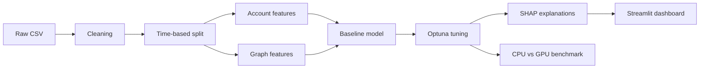

# AML Detection: Finding Money Laundering in Bank Transactions

End-to-end anti-money laundering detection on synthetic bank transactions: data cleaning, graph features, Optuna-tuned XGBoost, SHAP explanations, and CPU vs GPU benchmarks.

> Status: work in progress. Phases are being completed one at a time.

---

## The problem

Banks are legally required to monitor transactions for money laundering. Rule-based systems
catch some cases but produce a very high number of false alerts, and every alert costs an
analyst time to review. The goal here is to flag suspicious transactions more accurately,
explain why each one was flagged, and show how much faster the pipeline runs on a GPU.

## Dataset

- IBM Transactions for Anti Money Laundering (AML), from Kaggle
- File used: `HI-Small_Trans.csv` (~5 million transactions)
- The data is **synthetic**, generated by IBM. Results here should not be read as real-world
  performance, but the pipeline and methods are the same ones a real system would use.

## Pipeline



## Data cleaning

<!-- TODO after Phase 1: what was found, what was changed, row counts before and after -->

## Key findings from EDA

<!-- TODO after Phase 2: 3 to 5 plain-language findings plus 2 to 3 charts -->

## Features

<!-- TODO after Phase 3 -->

**Transaction features:**

**Account behaviour features (past data only):**

**Graph features:**

### Avoiding data leakage

<!-- TODO after Phase 3: explain the time-based split and why no future data is used -->

## Results

<!-- TODO after Phase 5 -->

| Model | PR-AUC | ROC-AUC | Precision | Recall | F1 | Business cost |
|---|---|---|---|---|---|---|
| Logistic regression | | | | | | |
| XGBoost (default) | | | | | | |
| XGBoost (tuned) | | | | | | |

Business cost uses assumed figures (see `config.yaml`): missing a laundering transaction is
treated as far more expensive than reviewing a false alert. These are assumptions for
demonstration, not real bank figures.

## Explainability

<!-- TODO after Phase 6: SHAP summary plot and one example explained in plain words -->

## CPU vs GPU benchmark

<!-- TODO after Phase 7: table and bar chart of speedups, plus hardware used -->

| Step | CPU time (s) | GPU time (s) | Speedup |
|---|---|---|---|
| Load and clean | | | |
| Feature engineering | | | |
| Graph features | | | |
| Model training | | | |
| Tuning (10 trials) | | | |

## Dashboard

<!-- TODO after Phase 8: screenshot or GIF, plus link if deployed -->

## How to run

```bash
# 1. Clone and set up
git clone <repo-url>
cd aml-detection
python -m venv venv
source venv/bin/activate        # Windows: venv\Scripts\activate
pip install -r requirements.txt

# 2. Download the data (needs a Kaggle API token at ~/.kaggle/kaggle.json)
kaggle datasets download -d ealtman2019/ibm-transactions-for-anti-money-laundering-aml -p data/raw --unzip

# 3. Run the pipeline
python -m src.data_cleaning
python -m src.features
python -m src.train
python -m src.tune

# 4. Launch the dashboard
streamlit run app/dashboard.py
```

The GPU benchmark (`notebooks/07_gpu_benchmark.ipynb`) is meant to be run in Google Colab
with a GPU runtime.

## Limitations

- The dataset is synthetic, so patterns are cleaner and more learnable than real transactions.
- The cost figures used for threshold selection are assumptions, not real bank numbers.
- A real system would need ongoing monitoring for model drift, plus checks that it treats
  different customer groups fairly.

## What I'd do next

<!-- TODO -->

## What I learned

<!-- TODO -->

## Tech stack

Python, pandas, scikit-learn, XGBoost, Optuna, SHAP, NetworkX, RAPIDS (cuDF / cuGraph),
Streamlit.
